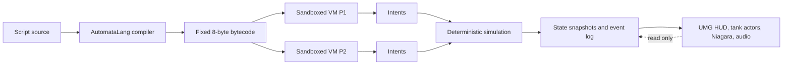

# Automata War

## What It Is

Automata War is a 1-versus-1 programming combat game built in C++ for Unreal Engine 5.5. Each player writes a short assembly-like behavior, submits it blind, and watches two deterministic robots execute concurrently on a seeded grid.

**The hook:** you never steer the robot; you debug the reason it lost.

## Replays Under 4 KiB

A replay stores only two UTF-8 script sources, one 64-bit seed, a replay version, a ruleset hash, and a CRC-32. It stores no transforms, snapshots, animation state, or video. Every viewer re-simulates the match locally.

The server accepts at most 1,800 bytes per script, so even the worst valid replay is 3,630 bytes. Replays can be saved under `Saved/Replays/`, browsed in-game, or exported and imported as a base64 string.

## Screenshots

| Programming                                       | Replay and autopsy                                  |
| ------------------------------------------------- | --------------------------------------------------- |
|  |  |


## The Language

Automata Lang compiles source once into fixed-size 8-byte instructions. Programs loop when the program counter reaches the end. Labels are resolved to instruction indices before simulation.

| Instruction                        |   Ticks | Energy | Meaning                                                       |
| ---------------------------------- | ------: | -----: | ------------------------------------------------------------- | -------------------------------------------------------------------- |
| `MOVE <FWD                         |  BACK>` |      2 | 2                                                             | Move one cell relative to facing; walls, cover, and robots block it. |
| `TURN <LEFT                        | RIGHT>` |      1 | 1                                                             | Rotate 90 degrees.                                                   |
| `SCAN`                             |       1 |      3 | Scan a forward 90-degree cone, range 8, with cover occlusion. |
| `FIRE`                             |       4 |     12 | Launch a 20-damage projectile that advances 4 cells per tick. |
| `SHIELD`                           |       3 |     15 | Absorb the next hit while remaining busy for the full action. |
| `SET <Rn> <imm>`                   |       1 |      0 | Write an integer in `[-32768, 32767]` to `R0..R3`.            |
| `IF <reg> <OP> <imm> JUMP <label>` |       1 |      0 | Branch with `== != < > <= >=`.                                |
| `WAIT`                             |       1 |      0 | Spend one tick without spending energy.                       |

Registers:

| Register       | Access     | Meaning                                                             |
| -------------- | ---------- | ------------------------------------------------------------------- |
| `R0..R3`       | Read/write | General-purpose integer registers.                                  |
| `R_HP`         | Read-only  | Current hit points.                                                 |
| `R_ENEMY_DIST` | Read-only  | Manhattan distance from the last successful scan; `0` means no hit. |
| `R_ENEMY_DIR`  | Read-only  | Relative scan direction: `-1` left, `0` ahead, `1` right.           |
| `R_ENERGY`     | Read-only  | Remaining energy.                                                   |
| `R_TICK`       | Read-only  | Current simulation tick.                                            |

Example behavior:

```asm
; Close distance until SCAN finds a target, then fire.
loop:
    SCAN
    IF R_ENEMY_DIST > 0 JUMP attack
    MOVE FWD
    IF R0 == 0 JUMP loop

attack:
    FIRE
    IF R0 == 0 JUMP loop
```

The complete grammar, semantics, and diagnostic catalogue are in [Docs/LANGUAGE.md](Docs/LANGUAGE.md). The in-game reference is generated from the same `InstructionDefs` and `RegisterDefs` tables used by the compiler and VM.

## Architecture



The source tree exposes three boundaries:

- `Core/`: engine-independent compiler, VM, simulation, and replay codec.
- `Game/` and `Net/`: Unreal match state, authoritative submissions, sessions, replication, and desync checks.
- `UI/` and `Visual/`: designer-owned UMG screen composition, native code editor behavior, level-authored tank actors, camera, runtime VFX, and sound.

The VM cannot query the arena or opponent. It emits an intent such as `MoveForward` or `Fire`; the simulation validates that intent against canonical integer state and applies the effect. Local play and online play both call the same authoritative `AAWGameMode::HandleSubmission()` and the same intent -> validation -> effect path.

Deleting the presentation layer still leaves a complete headless match. The automation suite proves this without loading art assets.

## Determinism

Determinism is the networking and replay model, not an optimization:

- Simulation state contains no floating-point values.
- Positions, directions, damage, energy, timers, and projectile travel are integers.
- One explicit xorshift PRNG owns all simulation randomness and is seeded by replay input.
- Outcome-sensitive collections are fixed arrays or stable indexed vectors.
- The simulation never reads Unreal tick, delta time, physics, animation, actors, or global RNG.
- Art and interpolation consume snapshots but never feed values back into `Core/`.
- Immediate values are range-checked at compile time; bounded counters halt or clamp before overflow.
- A canonical state hash includes robots, registers, projectiles, cover, tick, and outcome state.

`AutomataWar.Core.Sim.Determinism` runs the same match 1,000 times and compares the final hash. Replay round-trip and alternate stepping-context tests provide separate checks.

## Networking

Online mode uses Unreal's listen-server model with `OnlineSubsystemNull`:

- The host creates a LAN session and remains authoritative.
- Clients can discover LAN sessions or join a direct IP address.
- Clients submit bounded source text; the server validates, compiles, and simulates it.
- The network replicates scripts, seed, outcome, and authoritative hash, not frame state.
- Each client re-simulates locally and compares its final hash to detect desyncs.
- Disconnects forfeit cleanly and session delegates are removed during teardown.

No Steam account, external service, or online credential is required.

## Build and Run

Verified engine: **Unreal Engine 5.5.4, changelist 40574608** (`++UE5+Release-5.5`). The `.uproject` explicitly uses `"EngineAssociation": "5.5"`.

Prerequisites:

- Unreal Engine 5.5 installed at the launcher default path or an equivalent registered location.
- Visual Studio 2022 with Desktop development with C++ and Game development with C++.
- Windows 10/11 SDK.
- Git LFS before cloning binary assets.

Build the editor target from PowerShell:

```powershell
$UE55 = "C:\Program Files\Epic Games\UE_5.5"
$Project = "$PWD\AutomataWar.uproject"
& "$UE55\Engine\Build\BatchFiles\Build.bat" AutomataWarEditor Win64 Development $Project -WaitMutex -NoHotReloadFromIDE
```

Launch:

```powershell
& "$UE55\Engine\Binaries\Win64\UnrealEditor.exe" $Project -game
```

Local mode:

1. Select **Local Match**.
2. Edit both side-by-side scripts or load Aggressor, Camper, or Kiter.
3. Use **Train** for private practice, then submit both scripts.
4. Inspect the replay, registers, source lines, and event log; choose **Next Round** to refine.

Online mode:

1. On the host, select **Host LAN**.
2. On the second build, select **Find LAN** and join the listed session, or enter the host address and select **Join IP**.
3. Each process submits its script. The listen server compiles and simulates both inputs.

Create a Development package:

```powershell
& "$UE55\Engine\Build\BatchFiles\RunUAT.bat" BuildCookRun `
  -project=$Project -noP4 -platform=Win64 -clientconfig=Development `
  -build -cook -stage -pak -archive -archivedirectory="$PWD\Build\Package"
```

## Testing

Run all tests headlessly:

```powershell
& "$UE55\Engine\Binaries\Win64\UnrealEditor-Cmd.exe" $Project `
  -unattended -nop4 -nosplash -nullrhi `
  -ExecCmds="Automation RunTests AutomataWar" `
  -TestExit="Automation Test Queue Empty"
```

Coverage includes compiler diagnostics, all VM opcodes and comparison operators, exact costs, program wrapping, invalid PC safety, energy exhaustion, projectile travel, scan direction, shield behavior, 1,000-run determinism, replay CRC/version/ruleset checks, worst-case replay size, headless simulation, network input validation, debugger stepping, and real asset resolution.

## Design Notes

Tick cost is the primary combat balance. Expensive actions are strong but leave the robot busy while its opponent continues to dispatch instructions. `WAIT` matters because it preserves energy and changes timing.

The language intentionally has only eight instructions. There is enough state for scanning, branching, timing, and tactical loops, but not enough syntax to hide behavior behind language complexity.

Blank-page paralysis is handled with three commented examples:

- **Aggressor:** scans, closes distance, and fires immediately.
- **Camper:** rotates through scans, shields periodically, and punishes a detected target.
- **Kiter:** maintains range and fires opportunistically.

## Art Pipeline and Credits

The arena foundation, walls, lighting, sky, camera, environment dressing, tanks, and gameplay class selection are editor-owned assets generated reproducibly by `BuildScripts/CreateArenaMap.py`. `WBP_AWHUD` owns only the responsive shell and composes six screen Widget Blueprints from `Content/UI/Screens`; the simulation screen reuses one dock WBP for both players. Native screen classes encapsulate controls and report semantic actions to `UAWHUDWidget`. The tactical grid, cover state, projectiles, tank transforms, and replay motion remain runtime presentation driven by simulation snapshots.

Two Quaternius CC0 tank meshes provide distinct player silhouettes through level-authored `BP_TankActor` instances, whose native parent is `AAWTankActor`. Context screens use opaque backdrops, while simulation and replay surround a central arena viewport with source, status, and control panels. The arena uses an orthographic top-down camera so the tactical grid has no perspective distortion. Birch trees, rocks, and stumps from Quaternius frame the arena outside the tactical grid. Project-authored materials are generated by `BuildScripts/GenerateAssets.py`; no visual asset influences simulation collision or line of sight.

The project also includes:

- Epic Niagara template derivatives for muzzle, trail, impact, shield, and destruction effects.
- Kenney CC0 sci-fi and UI sound effects.
- Quaternius CC0 tanks and low-poly nature models.
- Roboto Mono and Rajdhani under SIL OFL 1.1.

Every third-party file, source URL, author, license, and acquisition date is listed in [Docs/CREDITS.md](Docs/CREDITS.md).

## Prior Art and Positioning

Automata War belongs to a lineage that includes **Core War (1984)**, **CRobots**, **Robocode**, **Gladiabots**, and **Screeps**. It is deliberately a small, self-contained take on programming combat. The technical focus is a hostile-input compiler, sandboxed intent VM, integer-only deterministic simulation, input-replicated LAN multiplayer, and a replay debugger that makes failure understandable.

## Known Limitations and Next Steps

- Online play is LAN/direct-IP only; NAT traversal and internet identity are intentionally absent.
- A disconnect is an immediate forfeit; a production service would add authenticated reconnect windows.
- Tank visuals are imported as rigid static meshes; track and turret animations are intentionally omitted.
- Replay stepping re-simulates from the start; periodic keyframes would improve very long future rulesets.
- Windows Development and Editor builds are verified; other target platforms need platform-specific packaging validation.
- The next gameplay step would be balance telemetry and seeded tournament fixtures, not a larger instruction set.

## Repository Layout

```text
Source/AutomataWar/
  Core/       Lang, VM, Sim, Replay
  Game/       GameMode, GameState, controllers, services
  Net/        Desync validation
  UI/         UMG HUD behavior, Slate code editor, replay debugger
  Visual/     Arena renderer, tank actors, camera, VFX drivers
Content/
  Art/        Imported meshes, generated materials, and Niagara systems
  Audio/      SFX
  Blueprints/ Gameplay and presentation Blueprint defaults
  UI/         Fonts and native-backed Widget Blueprints
  Maps/       Editor-authored arena map
Docs/         Language spec, credits, screenshots
```

See [DECISIONS.md](DECISIONS.md) for the architecture decision log and [LICENSE](LICENSE) for code licensing.
