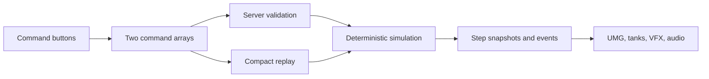

# Automata War

Automata War is a deterministic 1-versus-1 tank game built in C++ for Unreal Engine 5.5. Players build an action queue with buttons, submit it, and watch both tanks execute their queues.

## Commands

Each command is relative to the tank's current facing:

| Command | Effect |
| --- | --- |
| `MOVE` | Move one cell forward. Walls, cover, and the other tank block movement. |
| `FIRE` | Fire straight ahead. The first tank or obstacle in the line is hit. |
| `TURN LEFT` | Rotate 90 degrees left from the tank's point of view. |
| `TURN RIGHT` | Rotate 90 degrees right from the tank's point of view. |

Commands execute once in order. A tank with a shorter queue waits while the other finishes. The round ends when both queues are exhausted or a tank is destroyed. There is no parser, bytecode, virtual machine, program loop, or match tick cap.

## Programming Screen

Each player panel contains:

- A scrollable action queue on the left.
- A scrollable **Available Commands** rail on the right.
- A red **Remove Action** button above the queue when at least one action exists.
- A **Submit** button that locks the queue for the round.

Free-form text entry is not available. See [Docs/LANGUAGE.md](Docs/LANGUAGE.md) for the complete command semantics.

## Replays

A replay stores two command arrays, a 64-bit seed, format version, ruleset hash, and CRC-32. It stores no snapshots, transforms, animation, or video. Playback re-simulates the finite command queues locally.

The maximum replay is below 1 KiB with the current 256-command-per-player limit. Replay format version 3 intentionally rejects compiler-era replay files.

## Architecture



- `Core/Sim`: Executes the four commands directly and owns canonical integer state.
- `Core/Replay`: Stores command bytes and provides step-based navigation.
- `Game/` and `Net/`: Authoritative submission, replication, sessions, replay storage, and desync checks.
- `UI/` and `Visual/`: Button-driven UMG screens and presentation-only arena actors.

Local and network play both use `AAWGameMode::HandleSubmission()`. The server validates non-empty bounded enum arrays, runs the same simulation, and replicates accepted commands, seed, outcome, and final hash.

## Determinism

- Canonical positions, directions, HP, cover health, and command indices are integers.
- Arena randomness uses one explicitly seeded xorshift generator.
- Resolution priority alternates by command step.
- Rendering interpolation never writes back to simulation state.
- A canonical hash includes grid, cover, tanks, and command positions.

## Build

Verified with Unreal Engine 5.5.4, changelist 40574608.

```powershell
$UE55 = "C:\Program Files\Epic Games\UE_5.5"
$Project = "$PWD\AutomataWar.uproject"
& "$UE55\Engine\Build\BatchFiles\Build.bat" AutomataWarEditor Win64 DebugGame $Project -WaitMutex
```

Regenerate the HUD assets after changing `BuildScripts/BuildHUD.py`:

```powershell
& "$UE55\Engine\Binaries\Win64\UnrealEditor-Win64-DebugGame-Cmd.exe" $Project `
  -run=pythonscript -script="$PWD\BuildScripts\BuildHUD.py" -unattended -nop4 -nosplash
```

## Tests

```powershell
& "$UE55\Engine\Binaries\Win64\UnrealEditor-Win64-DebugGame-Cmd.exe" $Project `
  -ExecCmds="Automation RunTests AutomataWar" `
  -TestExit="Automation Test Queue Empty" -unattended -nop4 -nosplash -nullrhi
```

The focused suite covers finite execution, no queue wrapping, tank-relative turns, deterministic hashes, replay round trips, invalid replay commands, maximum payload size, labels, and replay navigation.

## Credits

Third-party assets and licenses are listed in [Docs/CREDITS.md](Docs/CREDITS.md). See [DECISIONS.md](DECISIONS.md) for architectural history.