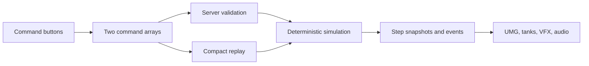

# Automata War

Automata War is a small 1v1 tank game made in C++ with Unreal Engine 5.5. Instead of controlling a tank in real time, each player queues up a few commands, submits them, and watches the turn play out.

## Commands

Each turn is an AP-budgeted queue built from seven commands. Movement, firing, and turning are relative to the tank's current facing:

| Command         |  AP | Effect                                                                  |
| --------------- | --: | ----------------------------------------------------------------------- |
| `MOVE`          |  10 | Move one cell forward. Walls, cover, and the other tank block movement. |
| `FIRE`          |  20 | Fire straight ahead. The first tank or obstacle in the line is hit.     |
| `TURN LEFT`     |   5 | Rotate 90 degrees left from the tank's point of view.                   |
| `TURN RIGHT`    |   5 | Rotate 90 degrees right from the tank's point of view.                  |
| `WAIT`          |   0 | Hold position for one command step.                                     |
| `CHARGE SHIELD` |  20 | Reduce the next incoming hit by 50%.                                    |
| `ACCELERATE`    |  30 | Make the next move cross up to two cells.                               |

Commands run once, in order, with exactly one tank acting per replay step. The round starter executes its entire queue without yielding; then the other tank executes its entire queue. After both turns finish, a player loses when their remaining AP is below the cheapest positive-cost command. If both players reach that state together, higher HP wins. Destroying a tank ends the match immediately.

## Turn Initiative

- Round 1 chooses the starting tank randomly on the server.
- Later rounds start with the player who owned more AP before programming began.
- Equal AP uses a new server-side random tie-break.
- The selected starter is replicated and stored in replay files.
- A turn means one tank's complete command queue; a round contains both turns.

## Programming Screen

Both players use the same `WBP_AWProgrammingPanel` layout. It has:

- A scrollable action queue on the left.
- A scrollable **Available Commands** rail on the right.
- A red **Remove Action** button above the queue when at least one action exists.
- A **Submit** button that collapses the panel like a CRT powering off.
- A **Return to Planning** button that cancels a submission without clearing the queue.

Commands are selected with buttons rather than typed as free-form text.

Single player and Local Versus both select Easy, Normal, or Hard difficulty, then an 8×8, 16×16, or 32×32 procedural arena. Difficulty gives both combatants 150, 100, or 75 starting AP respectively; in single player it also selects the AI planning depth. The server-owned `AAWAIController` generates slot 1's queue and submits it through the same validation path as human players.

## Pickups

- AP pickups add 10-20 action points.
- Extra ammo adds 10 shot damage for two rounds.
- Temporary shields reduce incoming damage by 50% for two rounds.
- Accelerators make moves cross up to two cells for two rounds.

Pickup state is canonical and included in replay inputs. Timed effects count the collection round as their first active round.

The UI uses a shared AW-80 phosphor-terminal style, including a software cursor and terminal button sounds. A project-authored layered score carries the setup flow, planning, replay analysis, and combat while preserving headroom for effects. Tank movement is intentionally silent.

Terminal results use reason-specific messages stored in `/Game/UI/Data/E_MatchResultMessage`. Local multiplayer displays one result popup for each player's viewpoint.

## Replays

A replay stores the two command arrays, round starter, canonical starting effects, a 64-bit seed, format version, ruleset hash, and CRC-32. It does not store snapshots, transforms, animation, or video. Playback simply simulates the command queues again.

With the current limit of 256 commands per player, a replay is under 1 KiB. Replay format version 8 and its ruleset hash reject files whose turn, command, terminal-outcome, or persistent-effect rules are incompatible.

## Architecture



- `Core/Sim`: Runs the seven commands and owns canonical integer state and pickup effects.
- `Core/Replay`: Stores command bytes and handles step-by-step replay navigation.
- `AI/`: Generates deterministic, AP-budgeted single-player command queues.
- `Audio/`: Owns persistent terminal ambience and context-driven music crossfades.
- `Game/` and `Net/`: Handle submissions, replication, sessions, replay storage, and desync checks.
- `UI/` and `Visual/`: Contain the UMG screens and the presentation-only arena actors.

Local and network play both go through `AAWGameMode::HandleSubmission()`. The server validates the commands, runs the simulation, and replicates the accepted commands, seed, outcome, and final hash.

## Determinism

- Canonical positions, directions, HP, cover health, and command indices are integers.
- Arena randomness uses one explicitly seeded xorshift generator.
- Exactly one tank acts per step; the starter's full queue runs before the opponent's full queue.
- Rendering interpolation never writes back to simulation state.
- A canonical hash includes grid, cover, tanks, and command positions.

## Build

The project is currently set up for Unreal Engine 5.5.4, changelist 40574608.

```powershell
$UE55 = "C:\Program Files\Epic Games\UE_5.5"
$Project = "$PWD\AutomataWar.uproject"
& "$UE55\Engine\Build\BatchFiles\Build.bat" AutomataWarEditor Win64 DebugGame $Project -WaitMutex
```

## Tests

```powershell
& "$UE55\Engine\Binaries\Win64\UnrealEditor-Win64-DebugGame-Cmd.exe" $Project `
  -ExecCmds="Automation RunTests AutomataWar" `
  -TestExit="Automation Test Queue Empty" -unattended -nop4 -nosplash -nullrhi
```

The test suite covers command execution, tank-relative turns, deterministic hashes, replay round trips, invalid replay commands, payload limits, labels, and replay navigation.

## Credits

Third-party assets and their licenses are listed in `Docs/CREDITS.md`.
